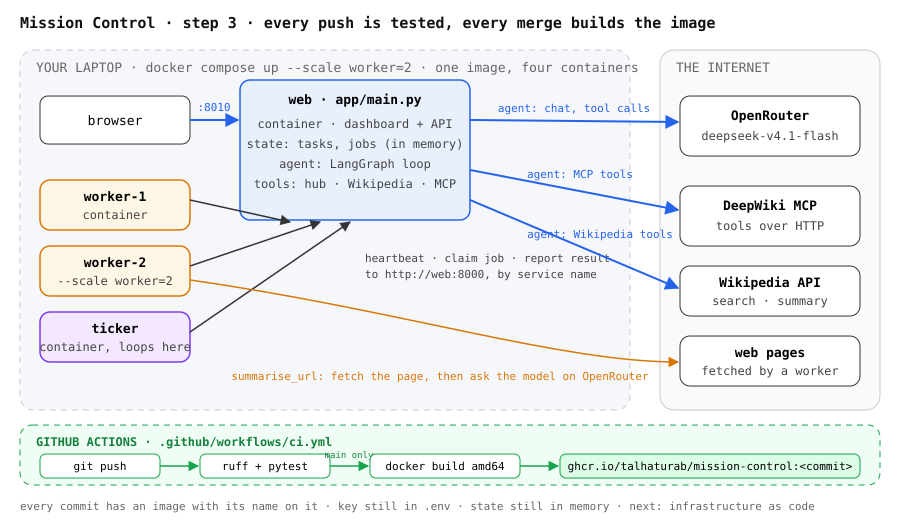

# Mission Control

A small application with four kinds of process, built to be deployed step by step:

| Process | What it does | How it runs on AWS |
|---|---|---|
| `web` | Serves the dashboard, holds the state, runs the agent | ECS Express service: Fargate behind a load balancer |
| `worker` | Asks the web process for jobs and does them | ECS service, several copies, autoscaled |
| `ticker` | Wakes up, posts a one-line report, exits | Scheduled ECS task |
| the agent | A LangGraph loop over DeepSeek with hub tools and MCP tools | Inside `web`, later on AgentCore |

Each commit on `main` is one step of that journey. Read them in order.



The diagram in `docs/architecture.svg` is redrawn at every step.

## Run it on a laptop

```bash
cp .env.example .env            # put your OpenRouter key in it
uv sync
uv run python -m app.dev        # web on :8000, two workers, and the ticker
```

Open http://localhost:8000. Submit a job and watch a worker take it. Ask the agent who is running.
If port 8000 is busy: `PORT=8010 uv run python -m app.dev`.

Or run the processes one per terminal: `make web`, `make worker`, `make ticker`.

## Run it in containers (step 2)

```bash
docker compose up --build --scale worker=2     # or: make up
```

One image, built from the `Dockerfile`, runs all four processes; the `command` in
`docker-compose.yml` decides which one each container is. The dashboard is on http://localhost:8010.
Workers reach the web process as `http://web:8000`, by service name, instead of `localhost`.

## Continuous integration (step 3)

`.github/workflows/ci.yml` runs on every push: lint and tests. On `main` it also builds the
image for `linux/amd64` and pushes it to a registry, tagged with the commit. Until step 5 that
registry was GitHub's own; now it is ECR.

## Infrastructure as code (step 4) and continuous deployment (step 5)

`infra/` is a CDK app with two stacks.

`Base` is deployed once, by hand: the ECR repository the pipeline pushes to, and an IAM role
GitHub Actions may assume with no stored key.

`MissionControl` is deployed by the pipeline on every merge to `main`: a small network, an ECS
cluster, the web process as an ECS Express service (Fargate behind a load balancer with an
HTTPS URL), the worker as a Fargate service with two tasks and a CPU autoscaling policy, and
the ticker as a scheduled Fargate task every five minutes. The only input that changes between
deploys is `image_tag`, the commit the pipeline just built.

One-time setup:

```bash
aws sso login --profile talhasandbox
aws secretsmanager create-secret --name mission-control/openrouter --secret-string "sk-or-..." \
  --region eu-west-2 --profile talhasandbox              # the key never enters git
cd infra && uv sync
cdk deploy Base --profile talhasandbox                     # prints DeployRoleArn
gh variable set AWS_DEPLOY_ROLE_ARN --body "arn:aws:iam::<account>:role/mission-control-github-deploy"
```

Then merge to `main`. The workflow tests, builds, pushes `mission-control:<commit>` to ECR, runs
`cdk deploy MissionControl -c image_tag=<commit>`, and curls the dashboard's `/health`. The first
run creates everything and takes about fifteen minutes; later runs take about eight.

By hand, the same deploy is `cdk deploy MissionControl -c image_tag=<commit> --profile talhasandbox`.
`cdk destroy MissionControl` removes everything the pipeline made; the images stay in ECR.

## Layout

```
app/main.py     the web process: dashboard, API, agent endpoint
app/state.py    tasks and jobs, in memory for now
app/agent.py    the LangGraph agent and its tools
app/worker.py   the worker loop
app/ticker.py   the scheduled task
app/jobs.py     what a worker can do: count_primes, summarise_url
app/hub.py      how workers talk to the web process
static/         the dashboard
Dockerfile      one image for every process
docker-compose.yml  the four processes as containers, for a laptop
.github/workflows/ci.yml  test on every push; on main, build, push to ECR and cdk deploy
infra/          two CDK stacks: Base (ECR, deploy role) and MissionControl (everything that runs)
tests/          run with: make test
```
